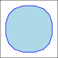
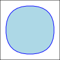

# simple demo of chaikin curves in python

paper: https://www.cs.unc.edu/~dm/UNC/COMP258/LECTURES/Chaikins-Algorithm.pdf

## example:

run `demo.py` to generate example svg files:

### open shape (aka polyline)

### closed shape (aka polygon)

